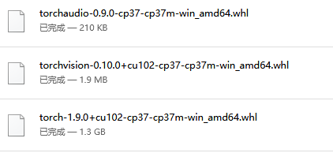
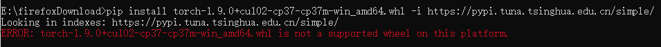
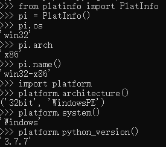
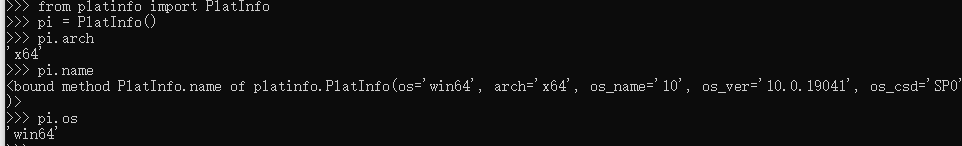

---

title: python
---

[toc]


# 一、环境配置

## virtualenv

### 1、安装

  通过pip安装virtualenv：

```
pip install virtualenv
```

  测试安装:

```
virtualenv --version
```

  为一个工程项目搭建一个虚拟环境:

```
cd my_project
virtualenv my_project_env
```

  另外，如果存在多个python解释器，可以选择指定一个Python解释器（比如``python2.7``），没有指定则由系统默认的解释器来搭建： 

```
virtualenv -p /usr/bin/python2.7 my_project_env
```

  将会在当前的目录中创建一个名my_project_env的文件夹，这是一个独立的python运行环境，包含了Python可执行文件， 以及 `pip` 库的一份拷贝，这样就能安装其他包了，不过已经安装到系统Python环境中的所有第三方包都不会复制过来，这样，我们就得到了一个不带任何第三方包的“干净”的Python运行环境来。


####  创建环境

```
virtualenv --no-site-packages venv
```

命令`virtualenv`就可以创建一个独立的Python运行环境，我们还加上了参数`--no-site-packages`，这样，已经安装到系统Python环境中的所有第三方包都不会复制过来，这样，我们就得到了一个不带任何第三方包的“干净”的Python运行环境。

新建的Python环境被放到当前目录下的`venv`目录。有了`venv`这个Python环境，可以用`source`进入该环境：

```
source venv/bin/activate
```

在`venv`环境下，用`pip`安装的包都被安装到`venv`这个环境下，系统Python环境不受任何影响。也就是说，`venv`环境是专门针对`myproject`这个应用创建的。

退出当前的`venv`环境，使用`deactivate`命令：


  用pip freeze查看当前安装版本

```
pip freeze
```

  另外：

```
pip freeze > requirements.txt
```

  这将会创建一个 `requirements.txt` 文件，其中包含了当前环境中所有包及 各自的版本的简单列表。您可以使用 “pip list”在不产生requirements文件的情况下，  查看已安装包的列表。这将会使另一个不同的开发者（或者是您，如果您需要重新创建这样的环境） 在以后安装相同版本的相同包变得容易。

```
pip install -r requirements.txt
```

  这能帮助确保安装、部署和开发者之间的一致性。

## virtualenvwrapper

### 1 Linux安装

virtualenvwrapper 时一个基于virtualenv之上的工具，它将所欲的虚拟环境统一管理。

安装：

    $ sudo pip install virtualenvwrapper

virtualenvwrapper默认将所有的虚拟环境放在～/.virtualenvs目录下管理，可以修改环境变量WORKON_HOME来指定虚拟环境 的保存目录。

使用如下命令来启动virtualenvwrapper：

    $ source /usr/local/bin/virtualenvwrapper.sh

还可以将该命令添加到/.bashrc或/.profie等shell启动文件中，以便登陆shell后可直接使用virtualenvwrapper提供的命令。

对于virtualenvwrapper的配置：

代码如下：

    if [ `id -u` != '0' ]; then
    
      export VIRTUALENV_USE_DISTRIBUTE=1        # <-- Always use pip/distribute
      export WORKON_HOME=$HOME/.virtualenvs       # <-- Where all virtualenvs will be stored
      source /usr/local/bin/virtualenvwrapper.sh
      export PIP_VIRTUALENV_BASE=$WORKON_HOME
      export PIP_RESPECT_VIRTUALENV=true
    
    fi


将上面的配置添加到 ~/.bashrc 的末尾，然后将下面的命令运行一次：

```
source ~/.bashrc
```

### 2 Windows安装

默认创建的虚拟环境位于C:\Users\username\envs,可以通过环境变量 WORKON_HOME 来定制。

通过计算机–>属性–>高级系统设置–>环境变量–>在系统变量中新建“变量名”：WORKON_HOME,变量值：“你自定义的路径”。

Win10配置好环境变量后需要重启生效

路径可以由你自己选择
 

用法

创建虚拟环境

    mkvirtualenv env27

创建指定解释器的虚拟环境

    mkvirtualenv -p python3.4 env34

启动虚拟环境

    workon env27

退出虚拟环境

    deactivate

删除虚拟环境

```
rmvirtualenv env27
```


## 包安装管理

whl 格式：这是一个压缩包，在其中包含了py文件，以及经过编译的pyd文件。

这个格式可以使文件在不具备编译环境的情况下，选择合适自己的python环境进行安装

#### 通过whl安装pytorch

Torch whl下载地址：

https://download.pytorch.org/whl/torch_stable.html

1.第一步：去pytorch的whl下载的地址下载官网给的命令中的torch和torchvision的版本的whl

(注意cpu 和 cuda版本区别)



2.第二步：用pip list查一下你有没有wheel这个库，一般是肯定有的，可以去确认一下

3.第三步：和一般用pip安装类似，不过这次是直接用whl文件,切记，此时要先安装torch，再去安装torchvision,否则也会报错。下面以安装torch的命令为例，cmd进入你torch的whl存放的目录，然后执行下面的命令。

```cpp
pip install torch-1.9.0+cu102-cp37-cp37m-win_amd64.whl -i https://pypi.tuna.tsinghua.edu.cn/simple/

pip install torchvision-0.10.0+cu102-cp37-cp37m-win_amd64.whl -i https://pypi.tuna.tsinghua.edu.cn/simple/

pip install torchaudio-0.9.0-cp37-cp37m-win_amd64.whl -i https://pypi.tuna.tsinghua.edu.cn/simple/
```

这里我用命令临时改成了清华的下载源，因为虽然这里已经把torch的whl下载了，但是它有可能要下载其他的库，所以用国内源下载还是会快很多。安装好torch后，接着安装torchvision就可以了。



出现这个问题，是由于这个whl**和系统python版本不匹配**导致的。

#### 查看python支持的whl

较新版本的pip**无效的方法**。

```
import pip._internal
print(pip._internal.pep425tags.get_supported())
print(pip.pep425tags.get_supported())
# 均为旧版pip的教程，并不适用于pip 20.0及以上版本，甚至不适用于临近pip 20.0的版本。使用上述旧教程，会得到pip has no attribute pep425tags。
```

**直接在命令行中输入，不要在Python解释器输入哦**：

```
pip debug --verbose
```

从中我们可以看到**Compatible tags**字样，这些就是当前Python版本可以适配的标签。

#### 检测底层操作系统平台

首先查看python版本

cmd打开命令行，输入python，查看。

如果32bit，则是32位；如果是64，则是64位


 


```
from platinfo import PlatInfo 
pi = PlatInfo()
pi.os
pi.arch
pi.name()

import platform
platform.architecture()
```

对于32位，`pi.name()`返回`win32-x86`






注意：

- 若安装的为32位python,则在python中无论如何检测都是32位Win

- 无论基础Windows系统的位数与python版本位数如何，`sys.platform`都将是`win32`